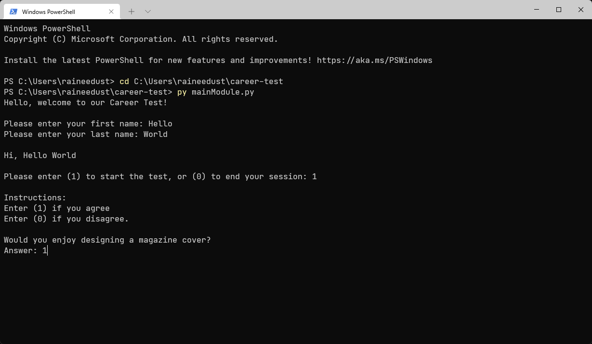

# Career Test

This is a simple, terminal-based career test.



## Usage

```shell
git clone https://github.com/raineedust/career-test.git
cd career-test
mainModule.py
```

## Motivation and Goals

This project is developed as according to the specs outlined in **ENGFF019**'s Python pair programming assessment.

- [x] Modular design
- [x] Implement loop structures (`for`, `while`)
- [x] Implement functions
- [x] Provide user-friendly input / output messages
- [x] Implement program continuation / termination based on user inputs
- [x] Provide data validation / error-checking for inputs
- [x] Provide test data samples

## Limitations

- Program auto-terminates when integer input fields receive non-integers.
- `careerResults.py` algorithm lacks fine-tuned suggestions, as well as more possibilities.

## Resources

Below are a collection of resources which helped improve my skills :sparkles: while building the project:

- [python - How do I restart a program based on user input? - Stack Overflow](https://stackoverflow.com/questions/14907067/how-do-i-restart-a-program-based-on-user-input)
- [python - TypeError: 'module' object is not callable - Stack Overflow](https://stackoverflow.com/questions/4534438/typeerror-module-object-is-not-callable)
